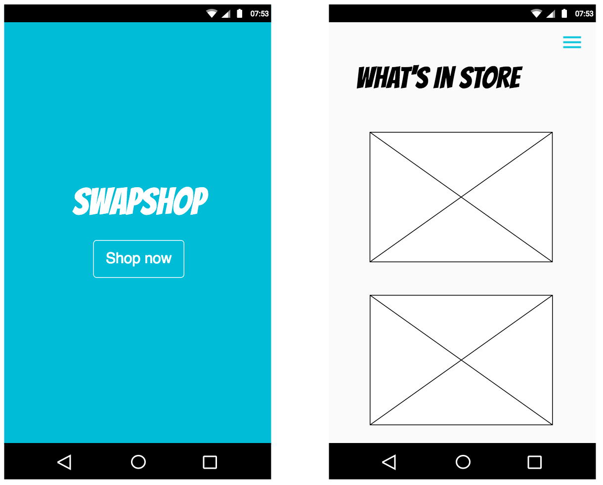
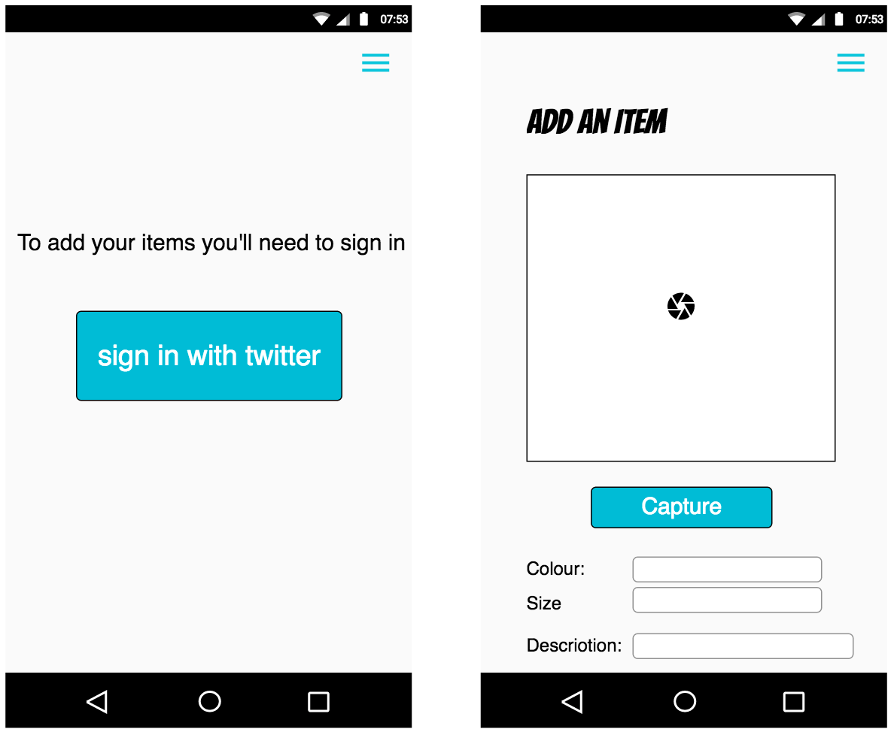
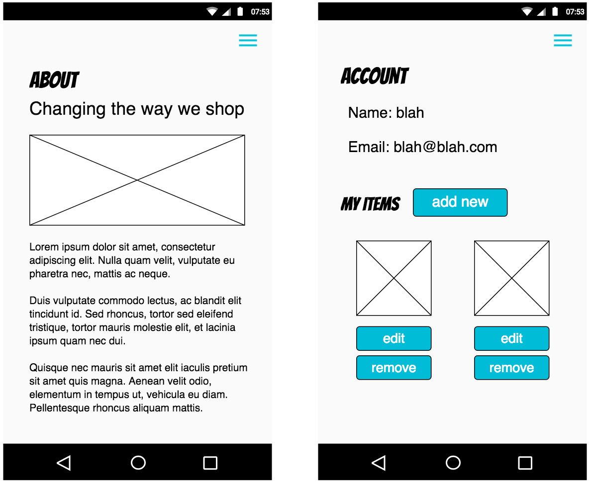

# SwapShop

A single page progressive web app using service worker. Still under development.

## Stack

+ Node
+ Riot
+ Handlebars
+ Postgres

## Installation

`git clone https://github.com/tas12/swap-shop.git && cd swap-shop`

`npm i`

`postgres -D /usr/local/var/postgres`

`npm start`

## Wireframes

